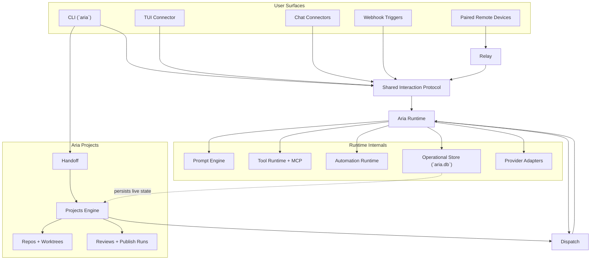

# Architecture

This section describes how the current repo is built and how the major subsystems divide ownership.

## Overall Diagram

- [monorepo.md](./monorepo.md)
- [runtime.md](./runtime.md)
- [storage-and-recovery.md](./storage-and-recovery.md)
- [prompt-engine.md](./prompt-engine.md)
- [tool-runtime.md](./tool-runtime.md)
- [projects-engine.md](./projects-engine.md)
- [relay.md](./relay.md)
- [handoff.md](./handoff.md)
- [providers.md](./providers.md)
- [interaction-protocol.md](./interaction-protocol.md)
