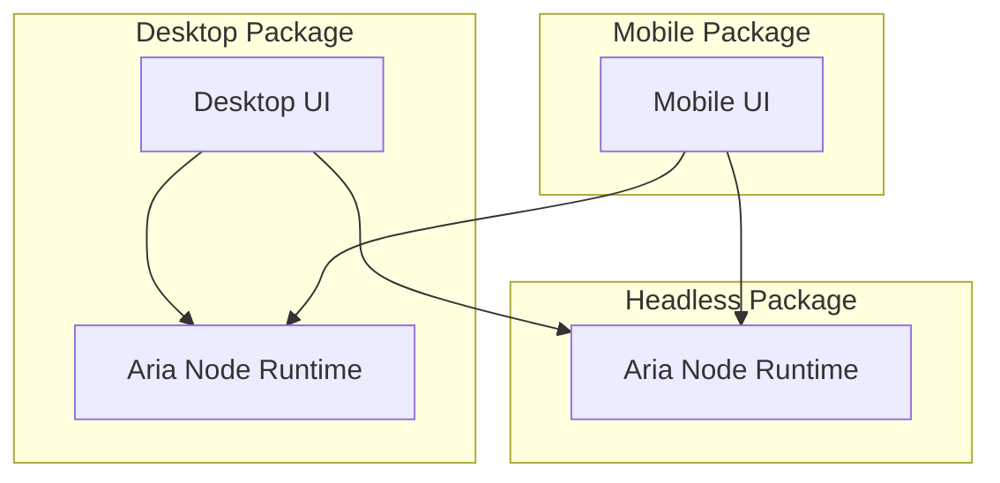

# Deployment Model

The deployable execution boundary is Aria Node Runtime.

## Installation Forms

## Desktop Package

Desktop contains:

- Desktop UI
- Desktop Client SDK
- Node Supervisor
- Aria Node Runtime
- Local Gateway
- Local Store
- Local Tools
- Local Workspaces

Desktop supports local chat, local files, local projects, local tools, local
memory, local automations, local connectors, and remote access from mobile or
another desktop.

## Headless Package

Headless contains:

- Service Manager
- Aria Node Runtime
- Gateway
- Store
- Tools
- Workspaces
- Automations
- Connectors

Headless supports remote jobs, remote project execution, scheduled
automations, webhook automations, IM connectors, mobile access, desktop remote
access, API access, approval flows, audit, memory, and secrets.

The runtime path is the same as Desktop. Only startup mode, service management,
frontend availability, default gateway exposure, and operator workflow differ.

## Mobile Package

Mobile contains:

- Mobile UI
- Remote Client SDK
- pairing and session management
- notification integration
- small UX cache

Mobile must not contain Aria Agent, Runtime Kernel, Tool Runtime, Sandbox
Runtime, Workspace Manager, Automation Engine, Connector Runtime, local project
execution, or local shell execution.

## Gateway Exposure

Default gateway exposure should be loopback-first. Operators may explicitly
publish the gateway over LAN, VPN, tunnel, reverse proxy, or direct public
endpoint, but reachability infrastructure does not change runtime semantics.

Gateway remains the authenticated command, query, and event boundary.
