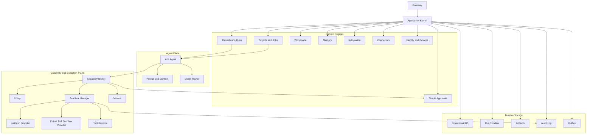

# Architecture Overview

The Aria architecture is one shared runtime with three installation forms.

```text
Desktop = Aria Node Runtime + Desktop UI
Headless = same Aria Node Runtime without Desktop UI
Mobile = remote client only
```

The most important rule is:

```text
Aria Agent runs only inside Aria Node Runtime.
```

## Product Surfaces

| Surface            | Role                                                                                                                                              |
| ------------------ | ------------------------------------------------------------------------------------------------------------------------------------------------- |
| `Desktop Package`  | Desktop UI plus local Aria Node Runtime, local gateway, local store, local tools, local workspaces, and node supervision.                         |
| `Headless Package` | Service-managed Aria Node Runtime for remote jobs, automations, connectors, API access, audit, secrets, memory, and mobile/desktop remote access. |
| `Mobile Client`    | Remote UI and SDK for chat, approvals, monitoring, artifacts, notifications, and session control.                                                 |

## Node Internal Architecture



## Responsibility Split

### Gateway

Gateway is the only Aria-owned access boundary.

It owns device pairing, session authentication, authorization, command API,
query API, event stream API, and gateway audit events.

It does not own agent execution, tool execution, workspace mutation, memory
writes, job orchestration, automation semantics, or project semantics.

### Application Kernel

Kernel coordinates runtime work.

It validates commands, enforces idempotency, opens transactions, loads state,
advances workflows, persists state, appends timeline and audit events,
schedules follow-up work, and publishes outbox messages.

Business rules live in domain engines. Side effects go through Capability and
Sandbox.

### Domain Engines

Domain engines own product state:

- Threads and Runs
- Projects and Jobs
- Workspace
- Memory
- Automation
- Connectors
- Simple Approvals
- Identity and Devices

### Agent Plane

Aria Agent is a workflow participant. It loads context, builds prompts, calls
the model router, streams assistant deltas, emits ToolIntent records, resumes
after tool results, and produces final answers.

It must not directly execute tools, write memory, mutate workspaces, run shell
commands, send connector messages, approve actions, store secrets, or schedule
automations.

### Capability and Execution

```text
Agent proposes.
Capability Broker classifies.
Policy allows, asks, or denies.
Approval asks only when required.
Sandbox Manager executes with the configured provider.
Audit records.
```

Policy does not select sandbox providers. Provider selection is explicit
configuration.

## Acceptance Criteria

- Desktop and Headless use the same Aria Node Runtime.
- Mobile connects to Desktop-hosted or Headless-hosted nodes.
- Mobile never hosts Aria Agent, tools, projects, automations, connectors, or sandbox.
- Local Desktop and remote Mobile sessions can attach to the same node.
- Long-running jobs survive Desktop UI restart.
- Every side effect goes through Capability Broker.
- Every tool execution goes through Sandbox Manager.
- `justbash` is the default sandbox provider.
- Unsupported justbash actions return clear unsupported results.
- Gateway remains the only Aria-owned access boundary.
