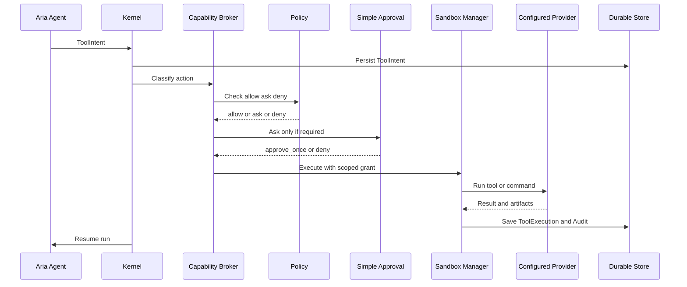

# Tool Runtime

Tools are manifest-driven capabilities. They are not raw functions directly
called by Aria Agent.

## Core Rule

```text
Agent
  -> ToolIntent
  -> Capability Broker
  -> Approval if needed
  -> Sandbox Manager
  -> Tool Runtime
```

No direct tool execution from agent code.

## Tool Manifest

```ts
type ToolManifest = {
  name: string;
  version: string;

  inputSchema: unknown;
  outputSchema: unknown;

  sideEffects: SideEffect[];

  requiredCapabilities: CapabilityRequirement[];

  approvalPolicy: ApprovalPolicy;

  sandboxProfile: SandboxProfile;

  secretPolicy?: SecretPolicy;
};
```

## Side-Effect Classes

```text
read_file
write_file
execute_shell
network_access
send_message
modify_repo
use_secret
persist_memory
create_artifact
```

## ToolIntent

A ToolIntent is the persisted request to perform an action. It is created
before capability, approval, or sandbox execution.

The Kernel persists ToolIntent records so runs can recover after restart and
auditors can inspect what was proposed versus what executed.

## Capability, Approval, Sandbox Flow



## ToolExecution

```text
ToolExecution
  id
  toolIntentId
  provider
  sandboxSessionId
  status
  stdout
  stderr
  result
  artifacts
  auditRefs
  startedAt
  completedAt
```

## Provider Independence

Tool Runtime depends on a generic sandbox session contract.

It must not depend directly on justbash internals, Daytona internals, container
internals, or VM internals.

## Sandbox Provider Selection

Provider selection is config-driven:

```text
Run-level explicit setting
  overrides Project-level setting
    overrides Node-level setting
      overrides default provider
```

Default:

```text
sandbox.provider = "justbash"
```

Policy decides `allow`, `ask`, or `deny`. Policy does not choose the sandbox
provider.
