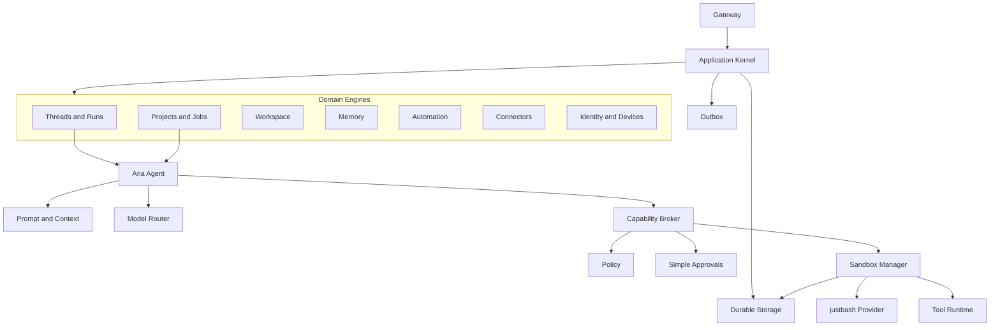

# Aria Node Runtime Surface

This page defines the internal component model of an Aria Node Runtime.

The file name remains `server.md` because existing project instructions link to
it. The target product term is `Aria Node Runtime`, not a separate server
runtime.

## Component Model



## Component Responsibilities

| Component          | Responsibility                                                                                                                |
| ------------------ | ----------------------------------------------------------------------------------------------------------------------------- |
| Gateway            | Pairing, session auth, authorization, command/query/event APIs, gateway audit.                                                |
| Application Kernel | Command bus, query bus, workflow engine, scheduler, unit of work, idempotency, domain events, outbox.                         |
| Domain Engines     | Product state and business rules for threads, projects, workspaces, memory, automations, connectors, approvals, and identity. |
| Aria Agent         | Run participant that reasons, streams assistant output, emits ToolIntent, and resumes after tool results.                     |
| Capability Broker  | Classifies ToolIntent, checks policy, coordinates approval, issues scoped grants, and dispatches to Sandbox Manager.          |
| Policy             | Decides `allow`, `ask`, or `deny`. Does not choose sandbox providers.                                                         |
| Simple Approvals   | Stores approval requests and `approve_once` or `deny` decisions.                                                              |
| Sandbox Manager    | Selects the configured provider, executes tool sessions, collects results, artifacts, patches, and audit.                     |
| Tool Runtime       | Manifest-driven built-in and extension tools behind the sandbox session contract.                                             |
| Durable Storage    | Operational DB, run timeline, artifacts, workspace store, secrets, audit log, and outbox.                                     |

## Primary Flows

### Desktop local chat

```text
Desktop UI
  -> local Aria Node Runtime
  -> Gateway
  -> Kernel
  -> Thread and Run
  -> Aria Agent
  -> Run Timeline
```

### Project job

```text
Client
  -> Gateway
  -> Kernel
  -> Projects and Jobs
  -> Aria Agent
  -> ToolIntent
  -> Capability Broker
  -> Sandbox Manager
  -> configured provider
  -> Artifact or Patch
```

### Automation

```text
Scheduler
  -> Automation Engine
  -> Command Bus
  -> Kernel
  -> Run
  -> Aria Agent
```

### Connector

```text
ExternalEvent
  -> Connector Runtime
  -> normalized command
  -> Command Bus
  -> Kernel
  -> Run
  -> Outbox delivery
```

## Headless Package

Headless packages this same runtime without Desktop UI.

It adds service management, server logs, daemon lifecycle, remote-first
configuration, and operator CLI behavior. It does not add a separate runtime
path.

## Must Not Happen

- Gateway must not contain assistant business logic.
- Agent Runtime must not call tools or shell directly.
- Policy must not choose sandbox providers.
- Mobile must not host Aria Agent, tools, projects, automations, connectors, or sandbox.
- Tools must not silently escape from justbash to host execution.
